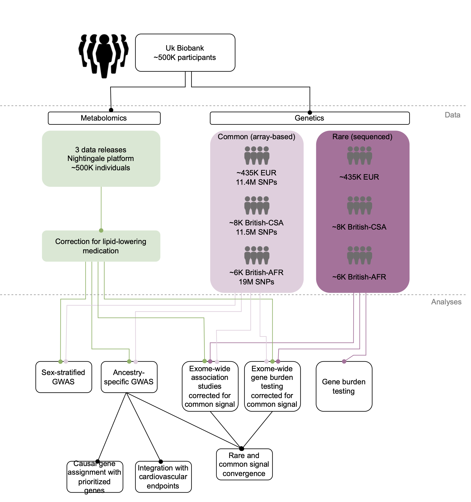

## A genetic map of human metabolism across the allele frequency spectrum

### Contents of this repository
This repository contains the analysis code included in the UKB mGWAS paper (doi: TODO). Code is provided as-is, not designed to work out of the box but rather to illustrate the analyses undertaken.

